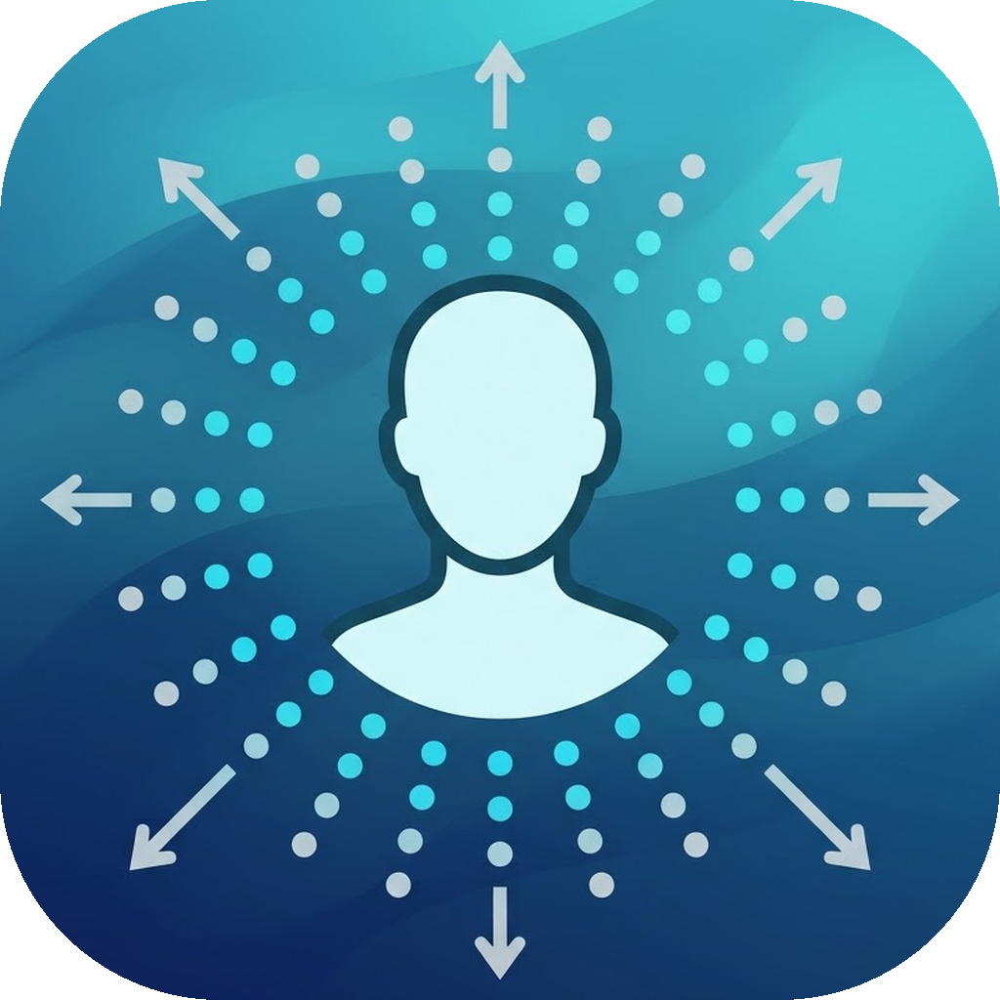

<p align="center">
  
</p>

# MotionSync - מניעת בחילות נסיעה

יישום רקע ל-Windows שמנצל את מצלמת הרשת של המחשב הנייד כדי לזהות תנועת
הרכב (Optical Flow) ומציג שכבת-על שקופה (Overlay) עם נקודות שזזות בכיוון
המנוגד לתנועת הרכב - ובכך מסנכרן את החוויה הוויזואלית עם תחושת שיווי
המשקל ומפחית בחילות נסיעה.

## יכולות

- **זיהוי תנועה חכם** - Lucas-Kanade Optical Flow על נקודות עניין ברקע,
  עם מיסוך אוטומטי של אזור הפנים (התעלמות מתנועות ראש של המשתמש) וחישוב
  וקטור דומיננטי עמיד לרעשים (חציון).
- **Overlay שקוף** - חלון בגודל המסך המלא, Always-on-Top ו-Click-Through
  מלא (לא חוסם קליקים או מקלדת), עם אנימציית אינטרפולציה חלקה.
- **System Tray** - הפעל/השהה, הגדרות ויציאה דרך תפריט קליק-ימני.
- **הגדרות** - רגישות, צבע, גודל ושקיפות הנקודות, מרווח הסריג ובחירת מצלמה.
- **100% Offline** - אין תקשורת רשת; אף פריים תמונה לא נשמר בדיסק.
- **נקודות בשולי המסך בשדה זרימה דו-ממדי** - כמו Vehicle Motion Cues
  של אפל: פנייה מזיזה את הסריג אופקית (נקודות נכנסות מצידי המסך),
  האצה/בלימה מזיזה אנכית; דהייה עדינה בכניסה וביציאה של נקודות.
- **צבע אדפטיבי** - דגימת בהירות הרקע: נקודה שחורה על רקע בהיר,
  לבנה על רקע כהה.

## הרקע המדעי (איך אפל וגוגל פתרו את הבעיה)

- **תיאוריית הקונפליקט החושי** (Reason & Brand, 1975): בחילת נסיעה נובעת
  מחוסר התאמה בין אותות שיווי המשקל באוזן הפנימית ("אני נע") לבין
  הקלט הוויזואלי ("אני עומד במקום") - בדיוק המצב כשעובדים על מסך סטטי
  ברכב נוסע.
- **Vection וראייה היקפית**: תחושת התנועה העצמית נשלטת בעיקר על ידי
  הראייה ההיקפית, שרגישה במיוחד לזרימה אופטית. לכן הנקודות ממוקמות
  דווקא בשולי המסך - היכן שהמוח "קורא" תנועה של הסביבה - ולא במרכז,
  שם הן רק תפריע לקריאה.
- **שדה זרימה אחיד 2D**: אפל (Vehicle Motion Cues ב-iOS 18) מציגה
  נקודות בקצוות המסך שנעות בכיוון תנועת הרכב: בפנייה נקודות נכנסות
  מצד אחד של המסך ויוצאות מצד שני, ובהאצה/בלימה הן נעות אנכית - כך
  שהעין מקבלת אישור ויזואלי שמתאים לתחושה הפיזית. MotionSync מחקה
  את ההתנהגות הזו מהזרמה אופטית אמיתית מהמצלמה, בלי חיישני IMU.
- **הכיוון**: הנקודות נעות בכיוון שבו הסביבה "זזה" יחסית למסך (שווה
  לשטף האופטי הנמדד), כלומר הפוך לכיוון תאוצת הרכב - בדיוק כמו
  הנוף האמיתי שנראה מהחלון.


## מקרי קצה מטופלים

1. **תאורה חלשה (נסיעת לילה)** - כשאין די נקודות לעקוב, הנקודות נדהמות
   בעדינות ומוצג חיווי אדום עדין בפינת המסך.
2. **ניתוק מצלמה / חסימת הרשאות** - הודעת שגיאה ברורה עם הנחיות לתיקון.
3. **שינוי רזולוציה / מסך חיצוני** - ה-Overlay מתאים את עצמו אוטומטית
   לגיאומטריית המסך הראשי.

## הורדה והתקנה

עותקים מוכנים זמינים בעמוד ה-Releases של המאגר:

| פלטפורמה | קובץ | מעבדים |
|---|---|---|
| Windows 10/11 | `MotionSync-Setup-x.y.z.exe` (התקנה מלאה) או `MotionSync.exe` (נייד) | x64 |
| macOS (אינטל) | `MotionSync-macOS-Intel.zip` | x86_64 |
| macOS (Apple Silicon) | `MotionSync-macOS-AppleSilicon.zip` | M1/M2/M3 (arm64) |

ההתקנה נבנית אוטומטית ע"י GitHub Actions בכל דחיפה ל-`main`, ומוצמדת
ל-Release בכל תג `v*`.

> **macOS:** בהרצה ראשונה ייתכן שיהיה צורך לאשר את האפליקציה דרך
> System Settings -> Privacy & Security ("Open Anyway"), ולתת הרשאת
> מצלמה. אפשר להריץ גם `xattr -cr /Applications/MotionSync.app` כדי
> להסיר סימון quarantine לאחר הורדה.

## התקנה מקומית (מהמקור)

```bash
pip install -r requirements.txt
python main.py
```

או פשוט הרצת `run_motionsync.bat` (Windows).

דרישות: Windows 10/11 (64-bit) או macOS 12+ / Python 3.9+, מצלמת רשת.

## הגדרות פרטיות של Windows

אם המצלמה חסומה: **הגדרות -> פרטיות -> מצלמה -> אפשר ליישומי שולחן עבודה
גישה למצלמה**.

## אריזה ל-EXE (שלב 4 באפיון)

```bash
pip install pyinstaller
pyinstaller --onefile --noconsole --name MotionSync main.py
```

קובץ ההפצה ייווצר תחת `dist\MotionSync.exe`.
